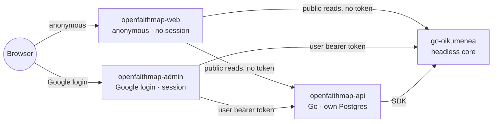

# OpenFaithMap

[](https://github.com/olehmushka/open-faith-map/actions/workflows/ci.yml)
[](LICENSE)

A free, open-source, **Christian** church-discovery-and-presence platform — a **map** (discovery)
and a per-congregation **site builder** (presence) — built as a facade on top of
[go-oikumenea](https://github.com/olehmushka/go-oikumenea), consumed as a headless internal core
via its docker image. go-oikumenea supplies identity, authorization, the organizational graph,
location, and the multi-faith religion taxonomy; OpenFaithMap supplies everything a general
directory/authz core has no reason to own: site content, public discovery UX, moderation, and a
web-of-trust vouching layer.

Two audiences: **visitors** (anonymous, use the map and read congregation sites) and
**congregation admins** (verified, manage one or more congregations' presence and roster). A small
platform-wide **moderator** roster handles reports, appeals, and the denomination-exclusion policy.
Geographic rollout: Ukraine + USA first, then Poland/UK, then the rest of EU/LATAM/Africa/Asia.

## Architecture

Three services, split by who can talk to them and whether they can ever hold a credential
(D-AdminSurface): an anonymous public UI, a verified admin UI, and a Go backend, all in front of an
unmodified, headless go-oikumenea core.



Plus two surfaces OpenFaithMap deploys but does not build: `oikumenea-console` (go-oikumenea's own
super-admin console, D-InstanceAdminConsole) and `hermenea` (its reference-data companion service,
D-BulkImport). Full detail — request paths, deployment topology, what's inherited from go-oikumenea
vs. new — lives in [docs/architecture/overview.md](docs/architecture/overview.md).

## Status

The [stage board](docs/milestones.md#stage-board) is authoritative.

> **Corrected 2026-08-17.** This section previously read "M0–M2.2 are built, M3–M6 are designed, M7
> is an idea" and listed `content`/`discovery`/`moderation`/`vouching` as not built. That was
> accurate around M2.2 and went stale as the build ran ahead of it. Nine modules are built.

In short: **M0–M6 are Verified, M7 and M8 are built but not yet Verified, M9 is a docs-only
deployment design with nothing provisioned, and M10 — absorbing the go-oikumenea core into this
repo — is decided but not started.**

Running today:

- **`openfaithmap-api`** with nine modules: `registration`, `content`, `discovery`, `moderation`,
  `vouching`, `congregationimport`, plus `coreintegration` and the platform/conjure scaffolding.
  Six Conjure contracts under `api/`, thirteen Atlas migrations under `migrations/`, and generated
  server code in `internal/conjure/`.
- **Two Next.js apps** (D-AdminSurface): `web/apps/web` (anonymous, no session, ever) and
  `web/apps/admin` (the only surface that ever holds a credential — login, registration wizard,
  operator console, roster, moderation queue, import review).
- **`docker-compose.yml`**: a real go-oikumenea instance from its published image (`0.0.7`), plus
  `oikumenea-console`, `hermenea`, and both OpenFaithMap apps. One shared Postgres, two schemas
  (D-SharedDatabase). **No Keycloak** — Google is the sole IdP (D-GoogleDirect).
- **Four import connectors**: `ua-edr` (Ukraine's ЄДР, HTTP-streaming, 30,721 records at full
  scale), `ar-rnc` (Argentina), `osm` (Overpass, scoped to UY/PY/CO/CL), and a `wikidata-catholic`
  jurisdiction-tree sync — plus a pluggable Nominatim geocoder.

**Where this is heading.** M10 (decided 2026-08-17, not started) removes the go-oikumenea dependency
entirely: its identity, authorization, unit-hierarchy, religion-taxonomy, site, location and
membership capabilities move into this repo as in-repo modules, and `openfaithmap-api` becomes a
single self-contained binary. See
[D-OwnCore](docs/architecture/decisions.md#d-owncore--openfaithmap-owns-its-core-go-oikumenea-is-removed)
for the reasoning and the [stage board](docs/milestones.md#stage-board) for the M10.x breakdown.
Much of what this README describes below — the `oikumenea-app` service, `internal/coreintegration`,
the `OIKUMENEA_SRC` sibling checkout, the mounted service-account key — is scheduled for removal
there.

## Repository layout

```
cmd/openfaithmap-api/   composition root — the openfaithmap-api binary
api/                    Conjure IDL contracts — the API source of truth
internal/conjure/       generated server code — never hand-edited
internal/               hexagonal modules (transport → application → domain → adapters),
                         one directory per docs/modules/*.md. Today: registration,
                         coreintegration, platform/config; content/discovery/moderation/
                         vouching are doc-only stubs.
migrations/             Atlas versioned migrations (openfaithmap schema)
scripts/                one-off bootstrap commands (service principal, admin person,
                         registration org) — the reproducible/CI path
docs/                   the binding design doc set — read this first
var/conf/               local-dev install.yml / runtime.yml
web/apps/web/           openfaithmap-web — anonymous public site, no session
web/apps/admin/         openfaithmap-admin — the only surface with a credential
deploy/                 install configs for the services this repo deploys but doesn't build
```

## Toolchain (D-Stack)

Same stack as go-oikumenea: Go + [gödel](https://github.com/palantir/godel) +
[Conjure](https://github.com/palantir/conjure) +
[witchcraft-go-server](https://github.com/palantir/witchcraft-go-server) + pgx/sqlc + Atlas
migrations, Next.js (App Router) for the web tier. See
[docs/architecture/decisions.md#d-stack--the-same-toolchain-as-go-oikumenea](docs/architecture/decisions.md).

## Quickstart

```sh
./godelw verify        # format + lint + test, the same gate CI runs
go run ./cmd/openfaithmap-api serve
curl -sk https://localhost:3001/status/liveness   # 3000 = app API, 3001 = management (health/readiness)
```

For the web tier, each app is independent (no npm workspace — D-AdminSurface):

```sh
cd web/apps/web   && npm install && npm run dev   # or web/apps/admin
```

### Testing locales

Both apps are locale-prefixed (`en`/`uk`/`es`/`pt`, English default) via next-intl —
`/` redirects to `/en`, and a language switcher in each app's header swaps locale while
preserving the current path. `web/apps/web/messages/` and `web/apps/admin/messages/`
hold the message catalogs; only `en.json` and the switcher's own language names are
real translations today, the rest are English placeholders pending review (see each
folder's `README.md`).

Running an app standalone (above) is enough to check routing/switching and any
backend-free page (e.g. openfaithmap-admin's `/en/login`, `/uk/login`, …) — pages that
call `openfaithmap-api`/go-oikumenea will error without a live backend, same as
without i18n. `openfaithmap-admin` also needs NextAuth's env vars just to boot:

```sh
cd web/apps/admin
AUTH_SECRET=dev-only-change-me AUTH_TRUST_HOST=true AUTH_GOOGLE_ID=test npm run dev -- -p 3004
```

To exercise locale-aware pages that need real data — the discovery map, the
registration wizard's tradition/country dropdowns, sign-in/sign-out staying on the
current locale — use the full stack below and visit `/en`, `/uk`, `/es`, `/pt` on each
app.

To bring up the full stack — needs a sibling checkout of
[go-oikumenea](https://github.com/olehmushka/go-oikumenea) for its migrations and `hermenea`'s
Dockerfile (neither is published as a standalone artifact yet), a GCP service-account key for the
service principal, and a populated `.env` (copy `.env.example`):

```sh
OIKUMENEA_SRC=../go-oikumenea docker compose up --build
docker run --rm --network open-faith-map_default -v "$PWD":/src -w /src golang:1.26-bookworm \
  go run ./scripts/bootstrap-service-principal -subject <google-service-account-numeric-sub>
```

Host ports: `3001` openfaithmap-api (management/health only — `curl -sk
https://localhost:3001/status/liveness`; its app port 3000 is compose-internal only, reached solely
by openfaithmap-web/openfaithmap-admin, same D-HeadlessTopology rule as oikumenea-app) · `3002`
openfaithmap-web · `3003` oikumenea-console · `3004` openfaithmap-admin · `5432` postgres ·
`9443`/`9444` hermenea. `oikumenea-app` publishes none at all (D-HeadlessTopology).

## Contributing

See [CONTRIBUTING.md](CONTRIBUTING.md) and [docs/development-process.md](docs/development-process.md)
for the feature pipeline (idea → decided → designed → backend → migrated → ui → verified) every
change moves through.

## License

Apache-2.0 — see [LICENSE](LICENSE) and [NOTICE](NOTICE).
