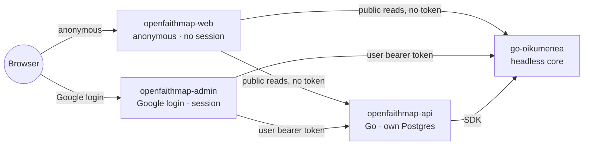

# OpenFaithMap

[](https://github.com/olehmushka/open-faith-map/actions/workflows/ci.yml)
[](LICENSE)

A free, open-source, **Christian** church-discovery-and-presence platform — a **map** (discovery)
and a per-congregation **site builder** (presence) — built as a facade on top of
[go-oikumenea](https://github.com/olehmushka/go-oikumenea), consumed as a headless internal core
via its docker image. go-oikumenea supplies identity, authorization, the organizational graph,
location, and the multi-faith religion taxonomy; OpenFaithMap supplies everything a general
directory/authz core has no reason to own: site content, public discovery UX, moderation, and a
web-of-trust vouching layer.

Two audiences: **visitors** (anonymous, use the map and read congregation sites) and
**congregation admins** (verified, manage one or more congregations' presence and roster). A small
platform-wide **moderator** roster handles reports, appeals, and the denomination-exclusion policy.
Geographic rollout: Ukraine + USA first, then Poland/UK, then the rest of EU/LATAM/Africa/Asia.

## Architecture

Three services, split by who can talk to them and whether they can ever hold a credential
(D-AdminSurface): an anonymous public UI, a verified admin UI, and a Go backend, all in front of an
unmodified, headless go-oikumenea core.



Plus two surfaces OpenFaithMap deploys but does not build: `oikumenea-console` (go-oikumenea's own
super-admin console, D-InstanceAdminConsole) and `hermenea` (its reference-data companion service,
D-BulkImport). Full detail — request paths, deployment topology, what's inherited from go-oikumenea
vs. new — lives in [docs/architecture/overview.md](docs/architecture/overview.md).

## Status

The [stage board](docs/milestones.md#stage-board) is authoritative. In short: **M0–M2.2 are built,
M3–M6 are designed, M7 is an idea.**

Running today:

- **`openfaithmap-api`** with its first real module, `registration` — congregation self-service
  submission, the D-Exclusions taxon check, and operator approval that performs real go-oikumenea
  writes with the operator's own forwarded token. Plus `api/registration.conjure.yml`,
  `migrations/0001_registration.sql`, and `internal/conjure/` generated server code.
- **Two Next.js apps** (D-AdminSurface): `web/apps/web` (anonymous, no session, ever) and
  `web/apps/admin` (the only surface that ever holds a credential — login, registration wizard,
  operator console, roster).
- **`docker-compose.yml`**: a real go-oikumenea instance from its published image, plus
  `oikumenea-console`, `hermenea`, and both OpenFaithMap apps. One shared Postgres, two schemas
  (D-SharedDatabase). **No Keycloak** — Google is the sole IdP (D-GoogleDirect).
- **`internal/coreintegration`**: a proven service-principal client — a GCP service account mints
  its own Google ID token per call, which go-oikumenea validates and resolves by
  `(issuer, subject)`. Proven against `connector.read`, **not** the `religion.read` grant these docs
  describe needing: every religion-module read endpoint denies machine subjects outright
  (`RequireAnywhere`, a person-only PEP path). That's a real go-oikumenea gap, tracked as M2.5.

Not built: `content`, `discovery`, `moderation`, `vouching` — designed only, see
[docs/](docs/). A 2026-08-09 audit also opened M2.3–M2.6 and M4.1 ahead of M3; **M2.3 and M2.4 both
carry defects in already-shipped code**, so read those before extending anything.

## Repository layout

```
cmd/openfaithmap-api/   composition root — the openfaithmap-api binary
api/                    Conjure IDL contracts — the API source of truth
internal/conjure/       generated server code — never hand-edited
internal/               hexagonal modules (transport → application → domain → adapters),
                         one directory per docs/modules/*.md. Today: registration,
                         coreintegration, platform/config; content/discovery/moderation/
                         vouching are doc-only stubs.
migrations/             Atlas versioned migrations (openfaithmap schema)
scripts/                one-off bootstrap commands (service principal, admin person,
                         registration org) — the reproducible/CI path
docs/                   the binding design doc set — read this first
var/conf/               local-dev install.yml / runtime.yml
web/apps/web/           openfaithmap-web — anonymous public site, no session
web/apps/admin/         openfaithmap-admin — the only surface with a credential
deploy/                 install configs for the services this repo deploys but doesn't build
```

## Toolchain (D-Stack)

Same stack as go-oikumenea: Go + [gödel](https://github.com/palantir/godel) +
[Conjure](https://github.com/palantir/conjure) +
[witchcraft-go-server](https://github.com/palantir/witchcraft-go-server) + pgx/sqlc + Atlas
migrations, Next.js (App Router) for the web tier. See
[docs/architecture/decisions.md#d-stack--the-same-toolchain-as-go-oikumenea](docs/architecture/decisions.md).

## Quickstart

```sh
./godelw verify        # format + lint + test, the same gate CI runs
go run ./cmd/openfaithmap-api serve
curl -sk https://localhost:3001/status/liveness   # 3000 = app API, 3001 = management (health/readiness)
```

For the web tier, each app is independent (no npm workspace — D-AdminSurface):

```sh
cd web/apps/web   && npm install && npm run dev   # or web/apps/admin
```

To bring up the full stack — needs a sibling checkout of
[go-oikumenea](https://github.com/olehmushka/go-oikumenea) for its migrations and `hermenea`'s
Dockerfile (neither is published as a standalone artifact yet), a GCP service-account key for the
service principal, and a populated `.env` (copy `.env.example`):

```sh
OIKUMENEA_SRC=../go-oikumenea docker compose up --build
docker run --rm --network open-faith-map_default -v "$PWD":/src -w /src golang:1.26-bookworm \
  go run ./scripts/bootstrap-service-principal -subject <google-service-account-numeric-sub>
```

Host ports: `3000`/`3001` openfaithmap-api · `3002` openfaithmap-web · `3003` oikumenea-console ·
`3004` openfaithmap-admin · `9443`/`9444` hermenea. `oikumenea-app` deliberately publishes none
(D-HeadlessTopology).

## Contributing

See [CONTRIBUTING.md](CONTRIBUTING.md) and [docs/development-process.md](docs/development-process.md)
for the feature pipeline (idea → decided → designed → backend → migrated → ui → verified) every
change moves through.

## License

Apache-2.0 — see [LICENSE](LICENSE) and [NOTICE](NOTICE).
