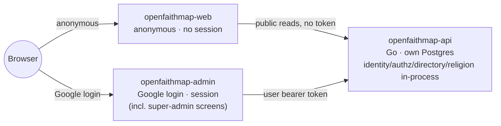

# OpenFaithMap

[](https://github.com/olehmushka/open-faith-map/actions/workflows/ci.yml)
[](LICENSE)

A free, open-source, **Christian** church-discovery-and-presence platform — a **map** (discovery)
and a per-congregation **site builder** (presence). `openfaithmap-api` is a single self-contained Go
binary: identity, authorization, the unit hierarchy, location, and the multi-faith religion taxonomy
all live in-process (`internal/{identity,authz,directory,location,religion,membership,refdata}`,
D-OwnCore), alongside the OpenFaithMap-specific modules a general directory/authz core would have no
reason to own: site content, public discovery UX, moderation, and a web-of-trust vouching layer.

Two audiences: **visitors** (anonymous, use the map and read congregation sites) and
**congregation admins** (verified, manage one or more congregations' presence and roster). A small
platform-wide **moderator** roster handles reports, appeals, and the denomination-exclusion policy.
An **instance-admin** plane (D-SuperAdminFold) manages people, role grants, units, and taxa.
Geographic rollout: Ukraine + USA first, then Poland/UK, then the rest of EU/LATAM/Africa/Asia.

## Architecture

Two services, split by who can talk to them and whether they can ever hold a credential
(D-AdminSurface): an anonymous public UI and a verified admin/super-admin UI, both in front of one
Go backend with its own Postgres database — no external core, no sibling checkout, no second
published image.



Full detail — request paths, deployment topology, module boundaries — lives in
[docs/architecture/overview.md](docs/architecture/overview.md).

## Status

The stage board is authoritative: [the active one](docs/milestones-2026-08-26-now.md#stage-board)
for anything after 2026-08-26, [the closed record](docs/milestones-2026-08-07-2026-08-26.md#stage-board)
for M0–M13.6 (all done).

> **Corrected 2026-08-18.** This section previously described a go-oikumenea-dependent architecture
> with M10 "decided but not started." M10 (D-OwnCore) is now built: the core it once depended on
> is absorbed in-process and the separate go-oikumenea/hermenea/oikumenea-console stack is deleted
> (M10.8's teardown).

In short: **M0–M9 are Verified or built, and M10 — absorbing go-oikumenea's core into this repo as
in-process Go modules and folding its super-admin console into `openfaithmap-admin` — is built
through M10.8 (M10.9's verification pass is the remaining gate before M10 itself is Verified).**

Running today:

- **`openfaithmap-api`**, one self-contained binary: `identity`, `authz`, `directory`, `religion`,
  `location`, `membership`, `refdata` (the absorbed core, D-OwnCore/D-CorePortScope), plus
  `registration`, `content`, `discovery`, `moderation`, `vouching`, `congregationimport`, and
  `core` (the admin app's own session-gated + super-admin Conjure surface, D-SuperAdminFold). Seven
  Conjure contracts under `api/`, twenty Atlas migrations under `migrations/` (collapsed by domain
  from twenty-three at the 2026-08-19 migration-collapse session, then folded further at the
  2026-08-25 pass — see docs/milestones-2026-08-07-2026-08-26.md), and generated server code in `internal/conjure/`.
- **Two Next.js apps** (D-AdminSurface): `web/apps/web` (anonymous, no session, ever) and
  `web/apps/admin` (the only surface that ever holds a credential — login, registration wizard,
  operator console, roster, moderation queue, import review, and the four instance-admin screens
  under People/Role Grants/Units/Taxa).
- **`docker-compose.yml`**: one Postgres instance, one schema (`openfaithmap`), and both OpenFaithMap
  apps — no external image, no sibling checkout, no second published service. **No Keycloak** —
  Google is the sole IdP (D-GoogleDirect), verified in-process (D-DirectTokenVerification).
- **Four import connectors**: `ua-edr` (Ukraine's ЄДР, HTTP-streaming, 30,721 records at full
  scale), `ar-rnc` (Argentina), `osm` (Overpass, scoped to UY/PY/CO/CL), and a `wikidata-catholic`
  jurisdiction-tree sync — plus a pluggable Nominatim geocoder.

See [D-OwnCore](docs/architecture/decisions.md#d-owncore--openfaithmap-owns-its-core-go-oikumenea-is-removed)
for the reasoning behind the absorption and the [stage board](docs/milestones-2026-08-07-2026-08-26.md#stage-board) for
the full M10.x breakdown.

## Repository layout

```
cmd/openfaithmap-api/   composition root — the openfaithmap-api binary
api/                    Conjure IDL contracts — the API source of truth
internal/conjure/       generated server code — never hand-edited
internal/               hexagonal modules (transport → application → domain → adapters),
                         one directory per docs/modules/*.md: the absorbed core
                         (identity/authz/directory/religion/location/membership/refdata,
                         D-OwnCore) plus registration/content/discovery/moderation/
                         vouching/congregationimport/core (the admin app's own surface).
migrations/             Atlas versioned migrations (openfaithmap schema)
scripts/                one-off local-dev tooling (e.g. mint-local-token)
docs/                   the binding design doc set — read this first
var/conf/               local-dev install.yml / runtime.yml
web/apps/web/           openfaithmap-web — anonymous public site, no session
web/apps/admin/         openfaithmap-admin — the only surface with a credential,
                         including the instance-admin screens (D-SuperAdminFold)
```

## Toolchain (D-Stack)

Go + [gödel](https://github.com/palantir/godel) + [Conjure](https://github.com/palantir/conjure) +
[witchcraft-go-server](https://github.com/palantir/witchcraft-go-server) + pgx/sqlc + Atlas
migrations, Next.js (App Router) for the web tier — the same toolchain go-oikumenea itself used,
kept even after its core was absorbed in-process (D-Stack). See
[docs/architecture/decisions.md#d-stack--the-same-toolchain-as-go-oikumenea](docs/architecture/decisions.md).

## Quickstart

```sh
./godelw verify        # format + lint + test, the same gate CI runs
go run ./cmd/openfaithmap-api serve
curl -sk https://localhost:3001/status/liveness   # 3000 = app API, 3001 = management (health/readiness)
```

For the web tier, each app is independent (no npm workspace — D-AdminSurface):

```sh
cd web/apps/web   && npm install && npm run dev   # or web/apps/admin
```

### Testing locales

Both apps are locale-prefixed (`en`/`uk`/`es`/`pt`, English default) via next-intl —
`/` redirects to `/en`, and a language switcher in each app's header swaps locale while
preserving the current path. `web/apps/web/messages/` and `web/apps/admin/messages/`
hold the message catalogs; only `en.json` and the switcher's own language names are
real translations today, the rest are English placeholders pending review (see each
folder's `README.md`).

Running an app standalone (above) is enough to check routing/switching and any
backend-free page (e.g. openfaithmap-admin's `/en/login`, `/uk/login`, …) — pages that
call `openfaithmap-api` will error without a live backend, same as
without i18n. `openfaithmap-admin` also needs NextAuth's env vars just to boot:

```sh
cd web/apps/admin
AUTH_SECRET=dev-only-change-me AUTH_TRUST_HOST=true AUTH_GOOGLE_ID=test npm run dev -- -p 3004
```

To exercise locale-aware pages that need real data — the discovery map, the
registration wizard's tradition/country dropdowns, sign-in/sign-out staying on the
current locale — use the full stack below and visit `/en`, `/uk`, `/es`, `/pt` on each
app.

To bring up the full stack — no sibling checkout, no service-account key, no
`docker.io/olegamysk/*` pull (D-OwnCore's teardown, M10.8) — just a populated `.env`
(copy `.env.example`) and a `var/conf/install.yml` (copy `var/conf/install.example.yml`;
gitignored since it carries the Postgres connection string, U12):

```sh
docker compose up --build
```

Host ports: `3001` openfaithmap-api (management/health only — `curl -sk
https://localhost:3001/status/liveness`; its app port 3000 is compose-internal only, reached solely
by openfaithmap-web/openfaithmap-admin, D-HeadlessTopology) · `3002` openfaithmap-web · `3004`
openfaithmap-admin · `5432` postgres.

## Contributing

See [CONTRIBUTING.md](CONTRIBUTING.md) and [docs/development-process.md](docs/development-process.md)
for the feature pipeline (idea → decided → designed → backend → migrated → ui → verified) every
change moves through.

## License

Apache-2.0 — see [LICENSE](LICENSE) and [NOTICE](NOTICE).
