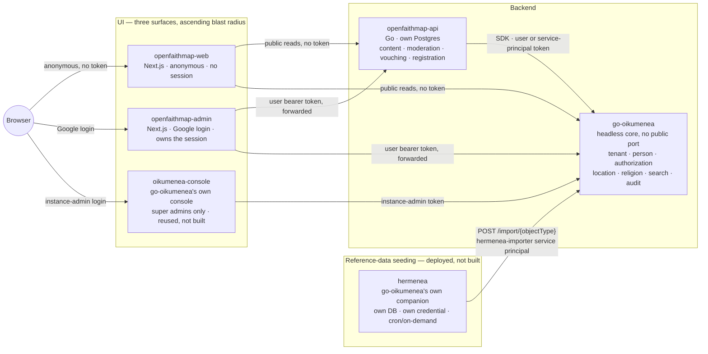

# Architecture overview

## Shape

OpenFaithMap is **three new services sitting in front of a headless go-oikumenea core** — two UI
surfaces, split by whether they can ever hold a credential (D-AdminSurface), plus one backend —
alongside **two things OpenFaithMap doesn't build**: a third, super-admin-only UI reused from
go-oikumenea itself (D-InstanceAdminConsole), and go-oikumenea's own reference-data companion
service, deployed (not built) by OpenFaithMap (D-BulkImport):

Three new binaries, same toolchain go-oikumenea uses (D-Stack):

- **`openfaithmap-web`** — a Next.js (App Router) server tier serving the anonymous public site
  only (map, search, congregation pages, public report filing). Holds **no session, no credential,
  no identity of any kind** (D-AdminSurface) — every call it makes is unauthenticated.
- **`openfaithmap-admin`** — a separate Next.js (App Router) server tier, the **facade** in the
  D-HeadlessTopology sense: it owns the httpOnly session (Auth.js, Google direct), and every call it
  makes to either go-oikumenea or `openfaithmap-api` forwards the logged-in user's bearer token. It
  never asserts its own authority. Serves the registration wizard, the operator-approval console,
  the congregation-admin console, and the moderator console — anything that requires being logged
  in. It is the *only OpenFaithMap-built* surface that can ever hold a credential.
- **`openfaithmap-api`** — a Go modular monolith, same hexagonal layering go-oikumenea uses
  (`transport → application → domain → adapters`), Conjure-contracted, its own Postgres. Owns
  `content`, `moderation`, `vouching`, and `registration` (see their module docs). For everything
  else it is a **pure client** of go-oikumenea's generated SDK — it holds no tenant/person/
  authorization state of its own (D-Facade).

Plus a third UI surface OpenFaithMap does **not** build, and a reference-data service OpenFaithMap
deploys but doesn't build either (D-InstanceAdminConsole, D-BulkImport — see
[architecture/decisions.md](decisions.md)):

- **`oikumenea-console`** — go-oikumenea's own published console image, reused unmodified, for
  super admins (go-oikumenea instance admins) only: the `religion_taxa` catalog, tenant structure
  instance-wide, service-principal issuance, other instance admins. Strictly larger blast radius
  than either OpenFaithMap surface — never gets a bare public host port beyond local dev (see
  [modules/import.md](../modules/import.md) and this doc's deployment topology below for the
  parallel with `oikumenea-app`'s own no-public-port rule).
- **`hermenea`** — go-oikumenea's own pre-existing reference-data companion service (countries,
  languages, external orgs, geo places), not built by OpenFaithMap. Deployed via this repo's own
  `docker-compose.yml` (its own database, its own `hermenea-importer` service-principal credential,
  HTTP-only coupling to go-oikumenea's core). Has no relationship to `registration` or
  `openfaithmap-api` at all — see [modules/import.md](../modules/import.md).

go-oikumenea itself is unmodified — run from its published docker image, headless
(D-CoreDependency), exactly as go-oikumenea's own `docker-compose.yml` runs its `app` container:
no host port published, reachable only over the compose-internal network.

**Build status.** All five services above exist in `docker-compose.yml` and run:
`openfaithmap-api` (M1/M2), `openfaithmap-web` and `openfaithmap-admin` (split at M2.1 —
[web-facade.md](../modules/web-facade.md) and [web-admin.md](../modules/web-admin.md)),
`oikumenea-console` (M1.2), and `hermenea` (M2.2). ~~What is *not* built is most of what
`openfaithmap-api` is eventually for: it owns exactly one module today, `registration`. `content`,
`discovery`, `moderation`, and `vouching` are designed only~~ — see the
[stage board](../milestones-2026-08-07-2026-08-26.md#stage-board), which is authoritative for stage.

> **Corrected 2026-08-17.** The struck sentence was accurate around M2.2 and went stale as the build
> ran ahead of this doc. `openfaithmap-api` owns **nine** modules: `registration` (M2), `content`
> (M3), `discovery` (M4), `moderation` (M5), `vouching` (M6), `congregationimport` (M8), plus
> `coreintegration` and the platform/conjure scaffolding. M7 (hardening) and M8 are built but not
> yet Verified; M9 is a docs-only deployment design with nothing provisioned. The stage board was
> correct throughout — this paragraph simply was not updated alongside it.

> **Reversed (M10.8, 2026-08-18) — the promised rewrite below is now overdue, not upcoming.**
> [D-OwnCore](decisions.md#d-owncore--openfaithmap-owns-its-core-go-oikumenea-is-removed) has
> absorbed go-oikumenea's capabilities into `openfaithmap-api` as in-repo modules
> (`internal/{identity,authz,directory,religion,location,membership,refdata}`, M10.1–M10.6) and
> M10.8 has deleted the `oikumenea-app`, `hermenea` and `oikumenea-console` services, the SDK, the
> npm client, and the `OIKUMENEA_SRC` sibling checkout — all for real, not just decided. Every
> HTTPS request path this document describes below (Postgres/service topology, the compose service
> table, the go-oikumenea-vs-OpenFaithMap comparison table) is now a stale description of a deleted
> system, not "temporary." The prior version of this note said the document "gets rewritten when
> M10.6 lands"; that didn't happen at M10.6, M10.7, or this M10.8 session either — a full accurate
> rewrite of the topology/request-path sections below is real, still-owed follow-up work, not
> attempted in this session's own cosmetic-cleanup pass. Until that rewrite lands, treat
> [README.md](../../README.md)'s Architecture section, `docker-compose.yml` itself, and the stage
> board as the accurate current sources — not this document's body text below.

## Request paths

**Anonymous discovery** (a visitor searching the map): browser → `openfaithmap-web` →
`openfaithmap-api` reads its own content cache **and** calls go-oikumenea's
`GET /religion/v1/discovery/sites` directly (~~unauthenticated public read~~ — **verified false,
see below**) → merged response rendered by `openfaithmap-web`. No user token exists anywhere in
this path — `openfaithmap-web` has none to forward, which is exactly why this path is broken.

> ❌ **Verified false (M2.5, 2026-08-09), and still false after the upstream fix.** Measured live: an
> unauthenticated `GET /religion/v1/discovery/sites` returns `401
> IdentityFederation:Unauthorized` — denied at authentication, before any authorization check even
> runs. "Unauthenticated public read" above is false as written; this request path as designed does
> not work today. Filed as [go-oikumenea#33](https://github.com/olehmushka/go-oikumenea/issues/33)
> and fixed same-day for the **machine-subject** half (the service principal can now read this
> endpoint, released as `docker.io/olegamysk/oikumenea:0.0.2`) — but #33 deliberately did not ask
> upstream to support genuine anonymous access, so this row is unchanged. Full measurement, both
> before and after the fix, in [core-integration.md](../modules/core-integration.md)'s
> authorization-touchpoints table and [milestones-2026-08-07-2026-08-26.md](../milestones-2026-08-07-2026-08-26.md)'s M2.5 detail. **M4's
> `designed` gate stays reopened** — the fix is not a small adjustment: `openfaithmap-web` must
> never call go-oikumenea directly for discovery reads at all, only OpenFaithMap's own
> `discovery_site_cache`, now concretely buildable since the service principal that populates it can
> actually read go-oikumenea — a real redesign for M4 to pick up, not attempted here.

**Authenticated write** (a congregation admin editing their site): browser (with session cookie) →
`openfaithmap-admin` extracts the bearer token from the session → calls `openfaithmap-api` for
content writes (its own PDP-free authorization check, delegated — see
[content.md](../modules/content.md#authorization-touchpoints)) and/or go-oikumenea directly for
anything tenant/person/religion-shaped (e.g. updating the congregation's clergy roster) — **always
forwarding the same user token**, never `openfaithmap-admin`'s or `openfaithmap-api`'s own
credential. Registration submission and operator approval follow the same shape, both originating
from `openfaithmap-admin` (see [registration.md](../modules/registration.md)) — submitting already
requires being logged in, so it was never a fit for the anonymous surface.

**Background job** (nightly discovery-cache refresh, moderation-queue sweep, vouching-graph
integrity check): `openfaithmap-api`'s own scheduler → calls go-oikumenea using its
**service-principal** client-credentials token (D-ServiceIdentities) → narrow, named grants only
(see [core-integration.md](../modules/core-integration.md#authorization-touchpoints)).

**Reference-data seeding** (countries, languages, external orgs): go-oikumenea's own `hermenea`
companion service — deployed by OpenFaithMap, built by neither — runs on its own cron (or is
triggered on demand via `POST /sync/{source-code}`), fetches from its configured source connectors,
and posts `CanonicalEnvelope` batches to go-oikumenea's core at `POST /import/{objectType}`,
authenticated as its own `hermenea-importer` service principal (`import.manage` only). Neither
`openfaithmap-web`, `openfaithmap-admin`, nor `openfaithmap-api` is in this path — `hermenea` talks
to go-oikumenea's core directly (D-BulkImport, see [modules/import.md](../modules/import.md)).

**Instance administration** (managing the religion taxonomy, issuing a new service principal,
bootstrapping a new instance admin): a super admin logs into `oikumenea-console` directly —
go-oikumenea's own console, reused unmodified (D-InstanceAdminConsole) — which talks to
`oikumenea-app` the same way any go-oikumenea console does. Neither `openfaithmap-web` nor
`openfaithmap-admin` is in this path at all; OpenFaithMap's own two surfaces never gain
instance-wide authority.

## Deployment topology

`open-faith-map/docker-compose.yml` (built at M1, extended at M1.2/M2/M2.1/M2.2 — see
[milestones-2026-08-07-2026-08-26.md](../milestones-2026-08-07-2026-08-26.md)) extends go-oikumenea's own compose pattern rather than
reinventing it. Two deviations from the original planned shape are now their own decisions:
[D-SharedDatabase](decisions.md) (one Postgres instance, two schemas — not two instances) and
[D-GoogleDirect](decisions.md) (Google is the sole IdP — no Keycloak service).

Everything below is **as built and running today** unless marked otherwise.

| Service | Host port | Notes |
|---|---|---|
| `postgres` | 5432 | One shared instance (D-SharedDatabase). Holds the `oikumenea` and `openfaithmap` schemas, plus `hermenea`'s own separate database. |
| `oikumenea-migrate` · `oikumenea-init-role` · `oikumenea-app` | — | go-oikumenea's own bootstrap sequence, published image. `oikumenea-app` publishes **no** host port (D-HeadlessTopology). |
| `openfaithmap-migrate` | — | Applies `migrations/` to the `openfaithmap` schema. Built at M2, not M3 as originally planned — `registration_requests` turned out to be OpenFaithMap's first schema. |
| `openfaithmap-api` | 3001 | Only the management/health port is published (**M2.4**); 3000 (the app port) is internal-only, reached by `openfaithmap-admin` over the compose network. |
| `openfaithmap-web` | 3002 | Anonymous public surface. Holds no Auth.js env vars at all since the M2.1 split. |
| `openfaithmap-admin` | 3004 | The only OpenFaithMap-built surface with a session. Holds the `AUTH_*` vars `openfaithmap-web` used to. Its own subdomain (e.g. `admin.openfaithmap.org`) once deployed beyond local dev. |
| `oikumenea-console` | 3003 | go-oikumenea's own published console, pinned to `:0.0.7`. See the exposure rule below. |
| `init-hermenea-db` · `migrate-hermenea` · `hermenea` | 9443 / 9444 | Persistent service with its own database and migration set. `hermenea` itself pulls a published image (`:0.0.7`, like `oikumenea-app`); its migrations still read from a sibling go-oikumenea checkout (not yet published standalone). See [modules/import.md](../modules/import.md)'s "Operating hermenea". |

Three exposure rules, in descending strictness:

- **`oikumenea-app` never gets a host port**, in any environment (D-HeadlessTopology). Reached only
  over the compose network at `https://oikumenea-app:8443`, self-signed cert, dev-only
  `NODE_TLS_REJECT_UNAUTHORIZED=0`.
- **`oikumenea-console` never gets a bare public port beyond local dev.** Its blast radius is
  instance-wide. D-InstanceAdminConsole decides a WireGuard VPN in front of it; not implemented
  because there is no real deployment target yet. It also shares an OAuth client with
  `openfaithmap-admin` today — see [D-OAuthClients](decisions.md).
- **`hermenea` publishes 9443/9444 in local dev**, gated only by a shared trigger token — read from
  `.env` since **M2.4**, previously a hardcoded literal in the compose file.

**Least privilege (M2.4, fixed).** `openfaithmap-api` no longer connects to the shared instance as
the `postgres` superuser — it connects as `openfaithmap`, a login role scoped to
`migrations/0003_least_privilege_role.sql`'s `openfaithmap_app` group role: `USAGE`/DML on the
`openfaithmap` schema only, no grant of any kind on `oikumenea`. See D-SharedDatabase's consequences
for how this was verified.

## What's unchanged from go-oikumenea, what's new

| | go-oikumenea | OpenFaithMap |
|---|---|---|
| Auth model | Delegates to external IdP, decides authorization (PDP) | Delegates *entirely* to go-oikumenea for anything tenant/person/religion-shaped; owns a narrow authorization check only for its own content/moderation/vouching tables. That check is a **target-scoped capability check** against go-oikumenea's PDP ([D-PlatformModerator](decisions.md)) — never a local role table, and never (as `content.md` originally proposed) a successful read treated as proof of write authority |
| Toolchain | Go + gödel + Conjure + witchcraft + pgx/sqlc + Atlas | Identical — with two documented deviations: `registration` uses hand-written pgx rather than sqlc, and `openfaithmap-api` has no TypeScript codegen pipeline yet (**M2.6**) |
| Schema | `oikumenea` schema, `oikumenea.<module>_*` tables | `openfaithmap` schema, `openfaithmap.<module>_*` tables in the **same** Postgres instance ([D-SharedDatabase](decisions.md)) — see [conventions.md](conventions.md) |
| UI | Optional Next.js admin console (`oikumenea-console`), BFF over the public API — super-admin-only, reused as-is by OpenFaithMap (D-InstanceAdminConsole) | Two separate Next.js apps (D-AdminSurface): `openfaithmap-web` (anonymous, no session) and `openfaithmap-admin` (the only OpenFaithMap-built surface that ever holds a credential), both facades over go-oikumenea and OpenFaithMap's own API |
| Exposure | Headless, internal-only (D-HeadlessTopology); `oikumenea-console` is a separate, more-privileged surface OpenFaithMap deploys but never widens | `openfaithmap-web` and `openfaithmap-admin` are the two intended public ingress points — still the target, not yet fully true: `openfaithmap-api` and `hermenea` both publish host ports today (**M2.4** narrows both; see deployment topology above) |
| Reference-data seeding | Ships `hermenea`, its own companion service (own DB, own service-principal credential, `POST /import/{objectType}`) | Deploys go-oikumenea's `hermenea` unmodified (D-BulkImport) — no code, no credential, no write path of its own |
