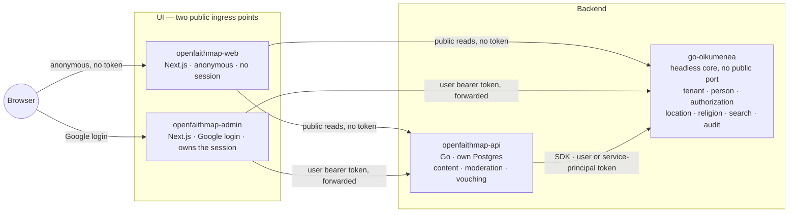

# Architecture overview

## Shape

OpenFaithMap is **three new services sitting in front of a headless go-oikumenea core** — two UI
surfaces, split by whether they can ever hold a credential (D-AdminSurface), plus one backend:

Three new binaries, same toolchain go-oikumenea uses (D-Stack):

- **`openfaithmap-web`** — a Next.js (App Router) server tier serving the anonymous public site
  only (map, search, congregation pages, public report filing). Holds **no session, no credential,
  no identity of any kind** (D-AdminSurface) — every call it makes is unauthenticated.
- **`openfaithmap-admin`** — a separate Next.js (App Router) server tier, the **facade** in the
  D-HeadlessTopology sense: it owns the httpOnly session (Auth.js, Google direct), and every call it
  makes to either go-oikumenea or `openfaithmap-api` forwards the logged-in user's bearer token. It
  never asserts its own authority. Serves the registration wizard, the operator-approval console,
  the congregation-admin console, and the moderator console — anything that requires being logged
  in. It is the *only* OpenFaithMap surface that can ever hold a credential.
- **`openfaithmap-api`** — a Go modular monolith, same hexagonal layering go-oikumenea uses
  (`transport → application → domain → adapters`), Conjure-contracted, its own Postgres. Owns
  `content`, `moderation`, and `vouching` (see their module docs). For everything else it is a
  **pure client** of go-oikumenea's generated SDK — it holds no tenant/person/authorization state
  of its own (D-Facade).

go-oikumenea itself is unmodified — run from its published docker image, headless
(D-CoreDependency), exactly as go-oikumenea's own `docker-compose.yml` runs its `app` container:
no host port published, reachable only over the compose-internal network.

**Not built yet.** `openfaithmap-admin` is a decided, designed target (D-AdminSurface,
[milestones.md](../milestones.md)'s M2.1) — the code that will become it currently still lives in
the single `web/` app built before this split. See [web-facade.md](../modules/web-facade.md) and
[web-admin.md](../modules/web-admin.md) for exactly what moves where.

## Request paths

**Anonymous discovery** (a visitor searching the map): browser → `openfaithmap-web` →
`openfaithmap-api` reads its own content cache **and** calls go-oikumenea's
`GET /religion/discovery/sites` directly (unauthenticated public read, `religion.read`) → merged
response rendered by `openfaithmap-web`. No user token exists anywhere in this path —
`openfaithmap-web` has none to forward.

**Authenticated write** (a congregation admin editing their site): browser (with session cookie) →
`openfaithmap-admin` extracts the bearer token from the session → calls `openfaithmap-api` for
content writes (its own PDP-free authorization check, delegated — see
[content.md](../modules/content.md#authorization-touchpoints)) and/or go-oikumenea directly for
anything tenant/person/religion-shaped (e.g. updating the congregation's clergy roster) — **always
forwarding the same user token**, never `openfaithmap-admin`'s or `openfaithmap-api`'s own
credential. Registration submission and operator approval follow the same shape, both originating
from `openfaithmap-admin` (see [registration.md](../modules/registration.md)) — submitting already
requires being logged in, so it was never a fit for the anonymous surface.

**Background job** (nightly discovery-cache refresh, moderation-queue sweep, vouching-graph
integrity check): `openfaithmap-api`'s own scheduler → calls go-oikumenea using its
**service-principal** client-credentials token (D-ServiceIdentities) → narrow, named grants only
(see [core-integration.md](../modules/core-integration.md#authorization-touchpoints)).

## Deployment topology

`open-faith-map/docker-compose.yml` (built at M1 — see [milestones.md](../milestones.md)) extends
go-oikumenea's own compose pattern rather than reinventing it. As built, this deviates from the
original planned shape in a few ways (no Keycloak, one shared Postgres — see M1's as-built note in
milestones.md):

- One shared `postgres` service (not a separate `oikumenea-postgres` instance) plus
  `oikumenea-migrate`, `oikumenea-init-role`, `oikumenea-app` — go-oikumenea's own bootstrap
  sequence, image pulled from its published registry, running against the `oikumenea` schema in
  that shared instance. `oikumenea-app` publishes no host port.
- `openfaithmap-postgres`, `openfaithmap-migrate` — **not built yet.** OpenFaithMap has no schema
  of its own until M3 (`content`/`moderation`/`vouching`); when it lands, it runs as its own
  `openfaithmap` schema in the same shared `postgres` service above, not a separate instance.
- `openfaithmap-api` — currently **also publishes host ports directly** (`3000`/`3001`), a real gap
  against the "only the UI surfaces are public ingress" target below; narrowing this is a follow-up,
  not yet its own milestone item.
- `openfaithmap-web` — publishes host port `3002`, built at M1. Reachable internally by
  `oikumenea-app` at `https://oikumenea-app:8443` (self-signed cert, dev-only
  `NODE_TLS_REJECT_UNAUTHORIZED=0`) since `oikumenea-app` has no host port of its own. Once
  D-AdminSurface's split lands in code, this service drops its Auth.js env vars
  (`AUTH_SECRET`/`AUTH_GOOGLE_*`/`AUTH_URL`) entirely — it will no longer run Auth.js at all.
- `openfaithmap-admin` — **not built yet** (D-AdminSurface, [milestones.md](../milestones.md)'s
  M2.1). Today's `openfaithmap-web` service in `docker-compose.yml` is what will eventually split
  into `openfaithmap-web` (public, above) and this new service — its own host port, and once
  deployed beyond local dev, its own subdomain (e.g. `admin.openfaithmap.org`), separate from the
  public site's origin. It inherits the Auth.js/Google env vars `openfaithmap-web` currently holds.
- No `keycloak` service — go-oikumenea is configured to trust Google directly
  (`deploy/oikumenea-install.yml`); both humans (via `openfaithmap-admin`'s Auth.js Google provider)
  and OpenFaithMap's service principal (a self-minted GCP service-account ID token) authenticate
  against the same Google issuer, distinguished by `(issuer, subject)` and audience.

## What's unchanged from go-oikumenea, what's new

| | go-oikumenea | OpenFaithMap |
|---|---|---|
| Auth model | Delegates to external IdP, decides authorization (PDP) | Delegates *entirely* to go-oikumenea for anything tenant/person/religion-shaped; owns a narrow authorization check only for its own content/moderation/vouching tables |
| Toolchain | Go + gödel + Conjure + witchcraft + pgx/sqlc + Atlas | Identical |
| Schema | `oikumenea` schema, `oikumenea.<module>_*` tables | `openfaithmap` schema, `openfaithmap.<module>_*` tables — see [conventions.md](conventions.md) |
| UI | Optional Next.js admin console, BFF over the public API | Two separate Next.js apps (D-AdminSurface): `openfaithmap-web` (anonymous, no session) and `openfaithmap-admin` (the only surface that ever holds a credential), both facades over go-oikumenea and OpenFaithMap's own API |
| Exposure | Headless, internal-only (D-HeadlessTopology) | `openfaithmap-web` and `openfaithmap-admin` are the two intended public ingress points — still the target, not yet fully true: `openfaithmap-api` also publishes host ports today, and `openfaithmap-admin` doesn't exist as a separate deployment yet (see deployment topology above) |
